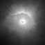

# Campedel - Nerelli | Creazione di un vulcano da Heightmap

È stato creato un vulcano (vulcano.html) sfruttando una HeightMap del Vesuvio presa da <a href="https://tangrams.github.io/heightmapper/">"Tangram Heightmapper"</a>, sono state aggiunte delle particles usando <a href="https://github.com/squarefeet/ShaderParticleEngine">Shader Particle Engine</a> per l'effetto eruzione e un'interazione terremoto - luci per dare l'effetto di lampi.

Heightmap usata:

Il vulcano è colorato usando un'interpolazione lineare sull'altezza in cui si sceglie il colore della base del vulcano e la cima.